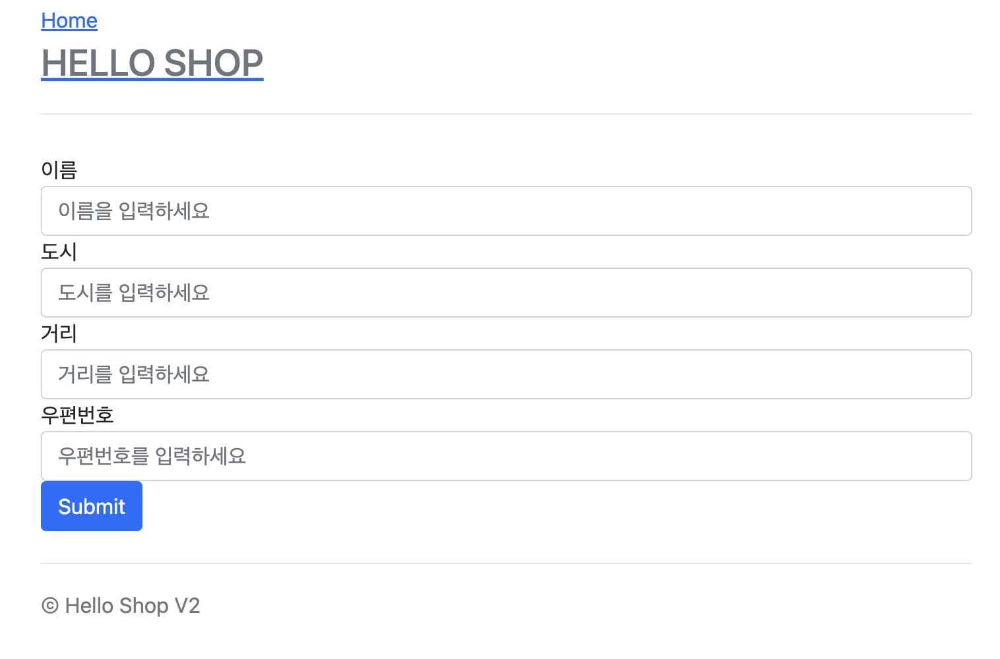

# Spring Order System

[스프링 부트-JPA 활용, 김영한](https://www.inflearn.com/course/%EC%8A%A4%ED%94%84%EB%A7%81%EB%B6%80%ED%8A%B8-JPA-%ED%99%9C%EC%9A%A9-1/dashboard)을 수강하며 만든 간단한 주문 시스템입니다.

## Tech stack

Spring

SpringBoot

h2 DB

Thymeleaf

## 구현

### 메인

### 회원 가입

### 회원 목록

### 상품 등록

### 상품 목록

### 상품 주문

### 상품 내역

